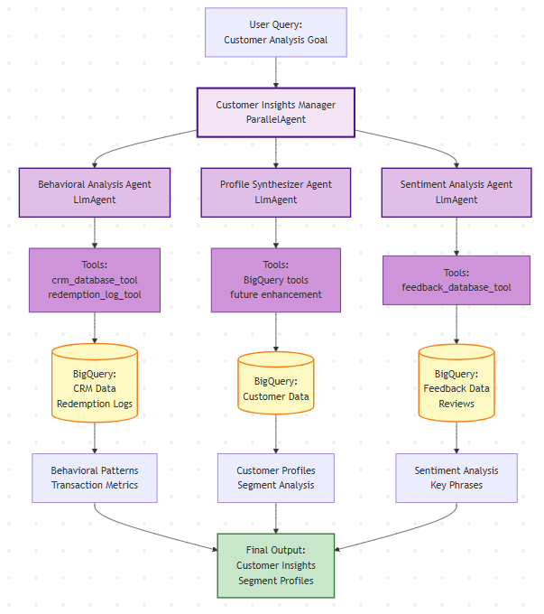
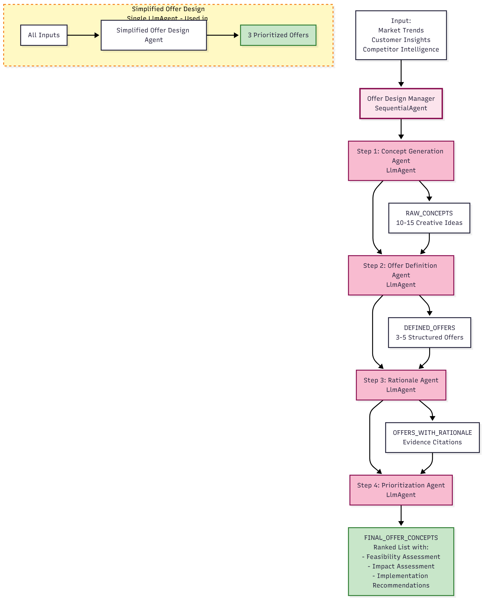
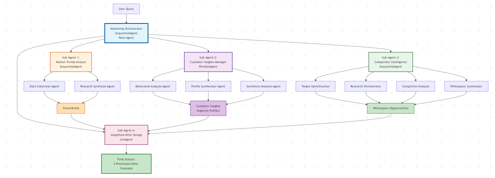

# Wendy's AI Agents Hackathon

**Date**: November 10, 2025  
**Time**: 10:30 AM - 12:00 PM (90 minutes)  

## Overview

Participants will modify and enhance Wendy's multi-agent AI system by updating agent instructions, tools, and models. The system relies on five collaborating agents—Market Trends Analyst, Customer Insights, Competitor Intelligence, Offer Design, and the Marketing Orchestrator—to deliver finalized offer recommendations.

## Hackathon Goal

**"Develop three innovative offers to increase breakfast traffic among Gen Z customers during Q1 (January-March) breakfast hours (6am-11am)"**

**Goal Parameters:**
- Customer Segment: Gen Z customers (ages 18-27)
- Time Period: Q1 (January-March)
- Daypart: Breakfast hours (6am-11am)
- Objective: Increase breakfast traffic and engagement
- Output: Three prioritized offer concepts with rationale

**Rationale:**
- Breakfast is an underperforming daypart for QSRs
- Gen Z is a key growth segment with distinct preferences
- Q1 presents seasonal challenges (post-holiday, winter weather)
- Breakfast requires different strategies than lunch/dinner

**Task**: Modify generic instructions and tools to align with this goal.


## Setup (10:30 - 10:40 AM)

### Prerequisites

- Python 3.10+
- Google Cloud SDK (`gcloud`) installed and authenticated
- Access to `dma-agentspace-dev-6cd2` Google Cloud project
- Git installed

### Clone Repository

Clone the repository to your local machine:

```bash
git clone <repository-url>
cd Wendy-hackathon
```

Replace `<repository-url>` with the actual repository URL provided by organizers.

### Environment Setup

**Important**: Use the commands for your operating system. Windows uses PowerShell commands, while Mac/Linux use bash commands.

#### Windows (PowerShell)

```powershell
# Create virtual environment
python -m venv venv

# Activate virtual environment (Windows PowerShell)
.\venv\Scripts\Activate.ps1

# If you get an execution policy error, run this first:
# Set-ExecutionPolicy -ExecutionPolicy RemoteSigned -Scope CurrentUser

# Install dependencies
pip install google-adk google-cloud-aiplatform google-cloud-bigquery

# Authenticate with Google Cloud
# This will open a browser window - use your Wendy's email to sign in
gcloud auth application-default login

# (Optional) Set Google Cloud project for gcloud commands
# Note: This is optional - your .env file will set the project for the agents
# If you get a password prompt, you can skip this step
# gcloud config set project cdp-tst-5fba

# Configure environment variables
Copy-Item .env.example .env
# Edit .env file with your GCP project details (project ID, project number, dataset name)

# Launch ADK Web Server
adk web src

# In a second terminal, start the Streamlit testing console
streamlit run ui/hackathon_agents_ui.py
```

**Windows Alternative** (if PowerShell activation doesn't work):
```cmd
# Use Command Prompt (cmd.exe) instead
venv\Scripts\activate.bat
```

#### Mac/Linux

```bash
# Create virtual environment
python3 -m venv venv

# Activate virtual environment
source venv/bin/activate

# Install dependencies
pip install google-adk google-cloud-aiplatform google-cloud-bigquery

# Authenticate with Google Cloud
# This will open a browser window - use your Wendy's email to sign in
gcloud auth application-default login

# (Optional) Set Google Cloud project for gcloud commands
# Note: This is optional - your .env file will set the project for the agents
# If you get a password prompt, you can skip this step
# gcloud config set project cdp-tst-5fba

# Configure environment variables
cp .env.example .env
# Edit .env file with your GCP project details (project ID, project number, dataset name)

# Launch ADK Web Server
adk web src

# In a second terminal, start the Streamlit testing console
streamlit run ui/hackathon_agents_ui.py
```

### System Components

- Multi-Agent System: Market Trends Analyst, Customer Insights, Competitor Intelligence, Offer Design, Marketing Orchestrator
- ADK Web Interface: Testing and debugging interface
- Streamlit Console (`ui/hackathon_agents_ui.py`): Guided testing console for all agents
- Instruction Files: Text files controlling agent behavior
- Tools: Python functions available to agents
- BigQuery Datasets: Customer data (read-only access)

## System Overview and Testing (10:40 - 11:15 AM)

### ADK Web Interface - Getting Started

ADK Web is the interface you'll use to interact with and test the multi-agent system. Here's how to get started:

#### Accessing ADK Web

1. **Open your web browser** and navigate to: `http://localhost:8000`
2. You'll see the ADK Web interface with:
   - **Agent Dropdown**: Select which agent to test (top of the page)
   - **Chat Interface**: Enter your queries and see responses
   - **Session Panel**: View conversation history
   - **Events Panel**: See step-by-step agent actions
   - **Trace View**: Visual representation of agent execution

#### Key Components Explained

**Sessions**:
- Each conversation creates a new session with full history
- Sessions preserve context across the conversation
- You can view previous sessions in the session panel
- Useful for comparing different runs of the same query

**Events**:
- Individual actions agents take (e.g., "Agent started", "Tool called", "Response generated")
- Events show step-by-step execution in real-time
- Click on events to see detailed information
- Use events to debug and understand agent behavior

**Trace**:
- Visual execution flow showing which agents ran
- Shows relationships between agents (parent-child)
- Displays timing and data flow between agents
- Click on nodes in the trace to see agent details

**Agent Selection**:
- Use the dropdown at the top to select which agent to test (agents are numbered 1-5 to match the orchestrated flow)
- Start with individual agents (`market_trends_analyst`, `customer_insights`, `competitor_intelligence`, `offer_design`) to understand each component
- Then test the full system with `marketing_orchestrator`

### 1. Market Trends Analyst


**Real-World Role**: At Wendy's, this would be filled by a **Market Research Analyst** who:
- Monitors industry trends, competitor campaigns, and consumer behavior shifts
- Scours news articles, social media, and industry reports
- Identifies emerging patterns relevant to fast-food and QSR markets
- Synthesizes findings into actionable trend briefs for the marketing team

**How Agents Achieve This**: Our Market Trends Analyst agent automates this research process using AI agents:
- **Data Collection Agent**: Acts like a research assistant, using Google Search to find relevant URLs and sources (replaces manual web browsing and article collection)
- **Research Synthesis Agent**: Acts like an analyst reading and summarizing articles (replaces manual reading and note-taking)

**Role of Tools & Models**:
- **Tools**: `google_search` tool allows the agent to search the web programmatically (like having a research assistant)
- **Tools**: `web_scraper_tool` reads article content from URLs (like having someone read and extract key information)
- **Models**: The LLM (Gemini) acts as the "analyst brain" that understands context, identifies patterns, and synthesizes insights (replaces human analytical thinking)

**Function**: Research market trends and consumer behaviors using web search

**Structure**:

**Root Agent**: `MarketTrendsAnalystRoot` (SequentialAgent)

**Sub-Agents**:

1. **Data Collection Agent**
   - Role: Collects raw data sources
   - Function: Uses Google Search to find URLs and trend data
   - Tools: `google_search`
   - File: `src/market_trends_analyst/sub_agents/data_collection/instruction.txt`

2. **Research Synthesis Agent**
   - Role: Analyzes collected data
   - Function: Reads URLs, extracts insights, synthesizes trend briefs
   - Tools: `web_scraper_tool`
   - File: `src/market_trends_analyst/sub_agents/research_synthesis/instruction.txt`

**Workflow**:
```
Input: Fixed goal query
  ↓
Data Collection Agent: Finds URLs about Gen Z breakfast trends, Q1 QSR campaigns
  ↓
Research Synthesis Agent: Reads articles, identifies breakfast-specific trends
  ↓
Output: Trend briefs focused on breakfast and Gen Z
```

**Testing Exercise**:

1. In ADK Web, select `market_trends_analyst` from the agent dropdown
2. Run focused queries to understand what this agent does:
   - **Example 1**: "What trends are you observing for Gen Z customers in the fast-food industry?"
   - **Example 2**: "What breakfast trends are emerging in QSR (Quick Service Restaurant) markets?"
   - **Example 3**: "What marketing strategies are QSR brands using to target Gen Z customers for breakfast?"
   - **Full Goal Query** (for comparison): "Develop three innovative offers to increase breakfast traffic among Gen Z customers during Q1 (January-March) breakfast hours (6am-11am)"
3. Observe session events appearing in real-time
4. View trace to see execution flow:
   ```
   MarketTrendsAnalystRoot (SequentialAgent)
     ├─ DataCollectionAgent (LlmAgent)
     │   ├─ Event: google_search tool called
     │   └─ Event: URLs collected
     └─ ResearchSynthesisAgent (LlmAgent)
         ├─ Event: web_scraper_tool called (for each URL)
         └─ Event: Trend briefs generated
   ```
5. Compare the focused queries with the full goal query - notice how the agent focuses on research and trend identification, not on creating offers
6. Review event list to see tool calls and data flow
7. **Key Observation**: This agent provides research and trends, which will be used by other agents (like Offer Design) to create actual offers

### 2. Customer Insights



**Real-World Role**: At Wendy's, this would be filled by a **Customer Insights Analyst** and **Data Scientist** who:
- Analyzes transaction data to understand customer behavior patterns
- Reviews customer feedback and sentiment from reviews and surveys
- Identifies customer segments and their preferences
- Creates customer profiles that inform marketing strategies
- Works with large datasets in BigQuery or similar data warehouses

**How Agents Achieve This**: Our Customer Insights agent automates data analysis using parallel processing:
- **Behavioral Analysis Agent**: Acts like a data analyst, querying BigQuery for transaction patterns (replaces SQL queries and manual data analysis)
- **Sentiment Analysis Agent**: Acts like a feedback analyst, analyzing reviews and comments (replaces manual reading and categorizing of feedback)
- **Profile Synthesizer Agent**: Acts like a insights manager, combining quantitative and qualitative data (replaces manual synthesis and report writing)

**Role of Tools & Models**:
- **Tools**: `crm_database_tool` and `feedback_database_tool` connect to BigQuery to query customer data (like having direct database access)
- **Tools**: BigQuery integration allows agents to run complex SQL queries automatically (replaces manual SQL writing and execution)
- **Models**: The LLM processes numerical data and text feedback, identifying patterns and generating insights (replaces human data interpretation)
- **Parallel Processing**: Multiple agents run simultaneously (like having multiple analysts working in parallel, much faster than sequential human work)

**Function**: Analyze customer behavioral data from BigQuery

**Structure**:

**Root Agent**: `CustomerInsightsManagerAgent` (ParallelAgent)

**Sub-Agents**:

1. **Behavioral Analysis Agent**
   - Role: Analyzes numerical data (redemptions, visits, spend)
   - Function: Queries BigQuery for transaction patterns, calculates metrics
   - Tools: `crm_database_tool`
   - File: `src/customer_insights/sub_agents/behavioral_analysis/instruction.txt`

2. **Sentiment Analysis Agent**
   - Role: Analyzes text feedback (reviews, comments)
   - Function: Queries feedback data, extracts sentiment and key phrases
   - Tools: `feedback_database_tool`
   - File: `src/customer_insights/sub_agents/sentiment_analysis/instruction.txt`

3. **Profile Synthesizer Agent**
   - Role: Combines quantitative and qualitative insights
   - Function: Creates customer profiles from behavioral and sentiment data
   - Tools: None (read-only BigQuery access)
   - File: `src/customer_insights/sub_agents/profile_synthesizer/instruction.txt`

**Workflow**:
```
Input: Fixed goal query
  ↓
Behavioral Analysis: Analyzes breakfast transactions → "12% of Gen Z app users visit for breakfast, 1.8x lift"
Sentiment Analysis: Analyzes breakfast reviews → "Gen Z customers say 'convenient morning', 'quick breakfast'"
  ↓ (Both run in parallel)
Profile Synthesizer: Combines both → "Gen Z breakfast customers prefer quick, convenient, app-exclusive morning offers"
  ↓
Output: Gen Z breakfast segment profiles with metrics and messaging
```

**Testing Exercise**:

1. In ADK Web, select `customer_insights` from the agent dropdown
2. Run focused queries to understand what this agent does:
   - **Example 1**: "What are the behavioral patterns of Gen Z customers in our database?"
   - **Example 2**: "What do customers say about breakfast offerings in their feedback?"
   - **Example 3**: "Analyze Gen Z customer segments and their breakfast visit patterns during Q1"
   - **Full Goal Query** (for comparison): "Develop three innovative offers to increase breakfast traffic among Gen Z customers during Q1 (January-March) breakfast hours (6am-11am)"
3. Observe trace showing Behavioral Analysis and Sentiment Analysis running simultaneously (parallel execution)
4. Note Profile Synthesizer runs after both complete
5. Compare with Market Trends sequential execution pattern - notice the difference in execution style
6. Review events to see BigQuery tool calls and data retrieval:
   - Look for `crm_database_tool` calls from Behavioral Analysis
   - Look for `feedback_database_tool` calls from Sentiment Analysis
   - See how both agents query BigQuery in parallel
7. **Key Observation**: This agent analyzes internal customer data from BigQuery, providing insights about our customers (unlike Market Trends which looks at external market data)

### 3. Offer Design



**Real-World Role**: At Wendy's, this would be filled by a **Marketing Strategist** or **Offer Design Manager** who:
- Takes market research and customer insights to brainstorm offer concepts
- Designs promotional offers (discounts, bundles, limited-time deals)
- Develops strategic rationale for each offer based on data and trends
- Prioritizes offers by feasibility and expected business impact
- Creates presentations for leadership with recommendations

**How Agents Achieve This**: Our Offer Design agent synthesizes all inputs into actionable concepts:
- **Simplified Offer Design Agent**: Acts as a marketing strategist, taking all research inputs and generating prioritized offer concepts in one step (replaces multi-person brainstorming sessions and strategic planning meetings)
- In the full version (4-step pipeline), this mimics a structured creative process: Concept Generation → Definition → Rationale → Prioritization

**Role of Tools & Models**:
- **Tools**: No tools needed - this agent works with text inputs from other agents (pure strategic thinking)
- **Models**: The LLM acts as the "creative strategist brain" that:
  - Generates creative offer ideas (replaces brainstorming)
  - Structures offers with mechanics, channels, and targets (replaces offer design templates)
  - Provides strategic rationale with evidence citations (replaces strategic justification writing)
  - Prioritizes by feasibility and impact (replaces business analysis)

**Function**: Synthesizes research into actionable offer concepts

**Structure**:

**Root Agent**: `SimplifiedOfferDesignAgent` (LlmAgent)

**Input**: Market trends, customer insights, competitor intelligence (if available)

**Output**: 3 prioritized offer concepts

**File**: `src/offer_design/sub_agents/simplified_offer_design/instruction.txt`

**Workflow**:
```
Input: 
  - Market Trends: "Breakfast convenience trending, 35% Gen Z morning engagement"
  - Customer Insights: "Gen Z breakfast users prefer app, 1.8x lift for breakfast offers"
  ↓
Simplified Offer Design Agent:
  - Generates 5-7 breakfast-focused ideas
  - Selects top 3 for Gen Z breakfast in Q1
  - Adds rationale, feasibility, impact
  ↓
Output: 3 prioritized breakfast offer concepts
```

**Testing Exercise**:

1. **Note**: Offer Design typically receives inputs from other agents (Market Trends and Customer Insights), so it's best tested through the Marketing Orchestrator (see section below)
2. If testing individually, you can provide sample inputs:
   - **Example Query**: "Based on these market trends: [Gen Z prefers convenience, breakfast is trending], and these customer insights: [12% of Gen Z visit for breakfast, 1.8x lift for breakfast offers], design 3 offer concepts for Gen Z breakfast customers"
3. Review the workflow diagram to understand how inputs flow into offer generation
4. **Key Observation**: This agent synthesizes research from Market Trends and Customer Insights into actionable offer concepts - it's the "strategic decision maker" that creates the final output

### 4. Overall System Architecture & Marketing Orchestrator


**Real-World Role**: At Wendy's, this would be filled by a **Marketing Director** or **Campaign Manager** who:
- Coordinates multiple teams (research, analytics, strategy) to work together on campaigns
- Ensures each team completes their work before the next team starts
- Synthesizes inputs from all teams into a final marketing plan
- Manages the end-to-end campaign development process
- Makes decisions about which teams to involve and in what order

**How Agents Achieve This**: The Marketing Orchestrator coordinates all specialized agents:
- **Sequential Coordination**: Like a project manager, it runs agents in the right order, ensuring each completes before the next starts
- **Data Flow Management**: Automatically passes outputs from one agent as inputs to the next (replaces manual handoffs and meetings between teams)
- **Integration**: Brings together market research, customer insights, and strategic planning into a unified workflow (replaces cross-functional team coordination)

**Role of Tools & Models**:
- **Architecture**: SequentialAgent pattern ensures proper workflow order (like having a project timeline)
- **Data Passing**: Automatically formats and passes data between agents (replaces status updates and handoff documents)
- **Orchestration Logic**: Manages the overall process, deciding when each agent runs (replaces project management and coordination)



**Function**: Coordinates all teams in sequence to produce final offer concepts

**File**: `src/marketing_orchestrator/agent.py`

**Workflow** (Current Configuration):
```
Input: User query (e.g., "Develop three innovative offers to increase breakfast traffic...")
  ↓
Step 1: Market Trends Analyst → breakfast trend_briefs[] (Gen Z, Q1 focused)
  ↓
Step 2: Customer Insights → Gen Z breakfast customer_insights, segment_profiles
  ↓
Step 3: Competitor Intelligence → competitor insights, whitespace opportunities
  ↓
Step 4: Offer Design → 3 prioritized breakfast offer_concepts[] (final output)
```

**How It All Comes Together**:

The Marketing Orchestrator brings together all the specialized agents into a cohesive system:
1. **Market Trends Analyst** provides external context (what's happening in the market)
2. **Customer Insights** provides internal context (what our customers want)
3. **Offer Design** synthesizes both into actionable strategies (what we should do)

This mimics how a real marketing department works: Research teams gather information, Analytics teams analyze data, and Strategy teams create plans - but the Marketing Director coordinates it all into a unified campaign.

**Testing Exercise**:

1. In ADK Web, select `marketing_orchestrator` from the agent dropdown
2. Run the **full goal query** (this is what the orchestrator is designed for):
   - **Query**: "Develop three innovative offers to increase breakfast traffic among Gen Z customers during Q1 (January-March) breakfast hours (6am-11am)"
3. Observe the trace showing the full 4-step workflow:
   - **Step 1**: Watch Market Trends Analyst execute first - notice it breaks down the query to focus on market research aspects
  - **Step 2**: See Customer Insights run - notice how it focuses on customer data analysis aspects (behavioral metrics)
  - **Step 3**: Watch Competitor Intelligence surface whitespace opportunities from rival campaigns
  - **Step 4**: Watch Offer Design receive all inputs (trends + insights + competitor gaps) and generate final output
4. Analyze events to see data transformation at each step:
   - Market Trends outputs → become inputs for Offer Design
  - Customer Insights outputs → flow into Competitor Intelligence context
  - Competitor Intelligence outputs → feed Offer Design alongside trends and customer metrics
  - Offer Design combines everything → final prioritized offers
5. Notice how the orchestrator automatically:
   - Breaks down the high-level query into appropriate sub-queries for each agent
   - Passes outputs from one agent as inputs to the next
   - Coordinates the entire workflow without manual intervention
6. Compare this full workflow with individual agent tests to understand:
   - How individual agents focus on specific tasks
   - How the orchestrator coordinates them into a complete solution
   - The difference between focused queries (for individual agents) and comprehensive queries (for orchestrator)

## Agent Modifications (11:15 - 11:45 AM)

### Modifiable Components

You can modify three key components to improve agent performance. Each component affects different aspects of agent behavior and output quality.

#### 1. Instructions
- **Location**: `src/[agent]/sub_agents/[sub_agent]/instruction.txt`
- **Impact**: Changes agent behavior, focus, output quality, and specificity
- **What it controls**: How the agent interprets tasks, what it focuses on, output format, constraints

**How Instructions Affect Outcomes:**

**Basic Instructions (Current Baseline)**:
```
You are a Data Collection Agent.
Your job is to find URLs and data about a topic.
Use the google_search tool to find URLs related to the topic.
Return a list of URLs you found.
```

**Problems with Basic Instructions**:
- ❌ Too vague - agent doesn't know what types of sources to prioritize
- ❌ No output structure - results are inconsistent
- ❌ No goal-specific focus - won't prioritize Gen Z breakfast trends
- ❌ No quality criteria - might return irrelevant URLs
- ❌ No constraints - agent might try to analyze instead of just collecting

**Advanced Instructions (Goal-Specific)**:
```
You are the Data Collection Agent (The "Hunter").
- Use google_search to find 10-15 relevant URLs from:
  * News articles about the topic
  * Blog posts and industry reports
  * Social media discussions
- Focus on QSR-specific and fast-food industry trends
- For Gen Z breakfast in Q1: Focus on breakfast trends, Gen Z preferences, 
  Q1 seasonal factors, morning routines, breakfast habits
- Return structured object with urls and trend_data
- DO NOT read or analyze content - just collect
```

**Benefits of Advanced Instructions**:
- ✅ Specific guidance - agent knows exactly what to do
- ✅ Goal-focused - prioritizes Gen Z breakfast in Q1
- ✅ Structured output - consistent format for next agent
- ✅ Clear constraints - prevents scope creep
- ✅ Quality criteria - ensures relevant sources

**Real Example - Behavioral Analysis Agent**:

**Basic (Current)**:
```
You are a Behavioral Analysis Agent.
Your job is to analyze customer data.
Use the crm_database_tool to query customer data.
Look at visits, spending, and customer segments.
Return what you find about customer behavior.
```

**Problem**: Output might be generic like "Customers visit restaurants" - not useful for Gen Z breakfast offers.

**Advanced (Goal-Specific)**:
```
Focus analysis on Gen Z customer segments (ages 18-27)
Analyze breakfast-specific behavioral patterns (6am-11am visits)
Always include percentage comparisons when analyzing segments
Compare metrics across at least 3 different Gen Z segments
Consider Q1 seasonal patterns in customer behavior
```

**Result**: Output becomes "12% of Gen Z app users visit for breakfast, showing 1.8x lift for breakfast offers compared to lunch. App channel shows 2.3x higher redemption for breakfast offers vs. in-store."

#### 2. Tools
- **Location**: `src/[agent]/sub_agents/[sub_agent]/tools.py`
- **Impact**: Adds new capabilities, improves data access, enables new analysis types
- **What it controls**: What data sources the agent can access, what actions it can perform

**How Tools Affect Outcomes:**

**Current Tools**:
- `google_search` - Finds URLs (Market Trends)
- `web_scraper_tool` - Reads web pages (Market Trends)
- `crm_database_tool` - Queries customer data (Customer Insights)
- `feedback_database_tool` - Queries reviews/comments (Customer Insights)

**Good Tool Usage**:
- ✅ **Specific queries**: `crm_database_tool` with focused SQL like "SELECT * FROM visits WHERE segment='Gen Z' AND time BETWEEN '06:00' AND '11:00'"
- ✅ **Multiple sources**: Using both `crm_database_tool` and `feedback_database_tool` for comprehensive analysis
- ✅ **Relevant data**: Tools access data directly related to the goal (Gen Z, breakfast, Q1)

**Bad Tool Usage**:
- ❌ **Generic queries**: `crm_database_tool` with "SELECT * FROM visits" (too broad, slow, irrelevant)
- ❌ **Missing filters**: Not filtering by segment, time, or date range
- ❌ **Wrong tool**: Using `google_search` when you need customer data from BigQuery

**Example - Adding a New Tool**:

**Scenario**: You want to analyze competitor pricing data.

**Bad Approach**: Agent tries to scrape competitor websites manually (slow, unreliable)

**Good Approach**: Add a `competitor_pricing_tool` that:
- Connects to a pricing database or API
- Returns structured pricing data
- Filters by competitor, product category, date range

**Result**: Agent can now provide specific competitive pricing insights: "McDonald's breakfast items average $4.50, while Wendy's averages $5.20. Opportunity: Price-match strategy for Gen Z value-conscious segment."

#### 3. Models
- **Location**: In agent.py files, `model=os.getenv("GEN_FAST_MODEL", "gemini-2.5-flash")`
- **Impact**: Changes reasoning quality, speed, cost, creativity
- **What it controls**: How well the agent understands context, generates creative ideas, follows complex instructions

**How Models Affect Outcomes:**

**Available Models**:
- `gemini-2.5-flash` (Fast) - Quick responses, lower cost, good for simple tasks
- `gemini-2.5-pro` (Advanced) - Better reasoning, higher cost, good for complex tasks

**Good Model Selection**:

**Use Fast Model (`gemini-2.5-flash`) for**:
- ✅ Data collection tasks (finding URLs, querying databases)
- ✅ Simple analysis (counting, basic calculations)
- ✅ Structured output generation (formatting data)
- ✅ High-volume, repetitive tasks

**Use Advanced Model (`gemini-2.5-pro`) for**:
- ✅ Complex synthesis (combining multiple data sources)
- ✅ Creative tasks (generating offer concepts)
- ✅ Strategic reasoning (prioritizing offers, assessing feasibility)
- ✅ Tasks requiring deep understanding of context

**Example - Offer Design Agent**:

**Fast Model (`gemini-2.5-flash`)**:
- Output: "Offer 1: Breakfast discount. Offer 2: Free coffee. Offer 3: BOGO sandwich."
- Problem: Generic, no strategic reasoning, no evidence citations

**Advanced Model (`gemini-2.5-pro`)**:
- Output: "Offer 1: App-Exclusive Gen Z Breakfast Bundle - $4.99 (was $7.50). Aligns with trend: 35% Gen Z morning engagement. Leverages insight: 1.8x lift for breakfast offers. Feasibility: Easy (existing app infrastructure). Impact: High (targets 12% of Gen Z app users)."
- Benefit: Strategic, evidence-based, actionable

**Trade-offs**:
- **Speed**: Fast model = 2-5 seconds, Advanced model = 10-30 seconds
- **Cost**: Fast model = $0.10 per 1M tokens, Advanced model = $1.25 per 1M tokens
- **Quality**: Fast model = Good for simple tasks, Advanced model = Better for complex reasoning

### Reference: Prompt Templates

We've created example instruction templates to help you improve agents:

**Location**: `prompt_templates/` folder

**Available Templates**:
- `data_collection_basic.txt` / `data_collection_advanced.txt`
- `research_synthesis_basic.txt` / `research_synthesis_advanced.txt`
- `behavioral_analysis_basic.txt` / `behavioral_analysis_advanced.txt`
- `sentiment_analysis_basic.txt` / `sentiment_analysis_advanced.txt`
- `offer_design_basic.txt` / `offer_design_advanced.txt`

**How to Use**:
1. Compare basic vs. advanced templates to see what improvements can be made
2. Copy relevant sections from advanced templates to improve your instructions
3. Customize for the specific goal (Gen Z breakfast in Q1)
4. Test and observe the differences in output quality

### Task 1: Improve Instructions Using Templates (25 min)

**Objective**: Improve agent instructions from basic to goal-specific, observe the impact on output quality.

#### Step 1: Baseline Test (5 min)

1. In ADK Web, select `marketing_orchestrator`
2. Run the fixed goal query: "Develop three innovative offers to increase breakfast traffic among Gen Z customers during Q1 (January-March) breakfast hours (6am-11am)"
3. **Save the output** - this is your baseline
4. Note the quality: Are the trends specific? Are customer insights detailed? Are offers well-reasoned?

#### Step 2: Improve Data Collection Agent Instructions (7 min)

1. **Review templates**:
   - Open: `prompt_templates/data_collection_basic.txt` (current baseline)
   - Open: `prompt_templates/data_collection_advanced.txt` (goal-specific version)

2. **Compare the differences**:
   - Basic: "Find URLs and data about a topic"
   - Advanced: Specific source types, goal focus (Gen Z breakfast), structured output, constraints

3. **Update the instruction file**:
   - Open: `src/market_trends_analyst/sub_agents/data_collection/instruction.txt`
   - Replace with content from `prompt_templates/data_collection_advanced.txt`
   - **Customize for Gen Z breakfast in Q1**: Add specific guidance about breakfast trends, Gen Z preferences, Q1 factors

4. **Test the change**:
   - Restart ADK Web if needed (stop with Ctrl+C, run `adk web src` again)
   - Run the same query with `marketing_orchestrator`
   - **Observe differences**:
     * Are URLs more relevant to breakfast and Gen Z?
     * Is the output more structured?
     * Are sources more diverse (news, blogs, social media)?

#### Step 3: Improve Behavioral Analysis Agent Instructions (7 min)

1. **Review templates**:
   - Open: `prompt_templates/behavioral_analysis_basic.txt` (current baseline)
   - Open: `prompt_templates/behavioral_analysis_advanced.txt` (goal-specific version)

2. **Compare the differences**:
   - Basic: "Analyze customer data" (too vague)
   - Advanced: Specific segments (Gen Z), time focus (breakfast hours), percentage comparisons, Q1 patterns

3. **Update the instruction file**:
   - Open: `src/customer_insights/sub_agents/behavioral_analysis/instruction.txt`
   - Replace with content from `prompt_templates/behavioral_analysis_advanced.txt`
   - Ensure Gen Z breakfast focus is included

4. **Test the change**:
   - Run the same query with `marketing_orchestrator`
   - **Observe differences**:
     * Are insights focused on Gen Z segments?
     * Are breakfast-specific patterns identified?
     * Are percentage comparisons included?
     * Is the output more actionable?

#### Step 4: Improve Offer Design Agent Instructions (6 min)

1. **Review templates**:
   - Open: `prompt_templates/offer_design_basic.txt` (current baseline)
   - Open: `prompt_templates/offer_design_advanced.txt` (comprehensive version)

2. **Compare the differences**:
   - Basic: "Create 3 offer concepts" (no structure, no rationale)
   - Advanced: Structured format, evidence citations, feasibility assessment, business impact, Gen Z breakfast focus

3. **Update the instruction file**:
   - Open: `src/offer_design/sub_agents/simplified_offer_design/instruction.txt`
   - Replace with content from `prompt_templates/offer_design_advanced.txt`

4. **Test the change**:
   - Run the same query with `marketing_orchestrator`
   - **Observe differences**:
     * Are offers more structured (mechanic, channel, duration, target)?
     * Are evidence citations included (aligns with trend X, leverages insight Y)?
     * Are feasibility and impact assessments provided?
     * Are offers breakfast-specific and Gen Z-focused?

#### Step 5: Compare Before and After (5 min)

1. **Review your baseline output** (from Step 1)
2. **Review your improved output** (from Steps 2-4)
3. **Document the improvements**:
   - What changed in the output quality?
   - Are trends more specific and relevant?
   - Are customer insights more actionable?
   - Are offers better structured and justified?
   - Is the overall output more useful for decision-making?

**Key Takeaway**: Better instructions lead to better outputs. The advanced templates provide:
- Goal-specific focus (Gen Z breakfast in Q1)
- Structured output formats
- Clear constraints and guidelines
- Evidence citation requirements
- Business context and rationale

### Advanced Path: Deepen Competitor Intelligence

Competitor Intelligence now runs by default in the orchestrator flow. Use this path if you want to push the competitive analysis further (more precise targets, richer comparisons).

#### Step 1: Review Current Agent Chain

**Root Agent**: `CompetitorIntelManagerAgent` (SequentialAgent)

**Sub-Agents**:

1. **Target Identification Agent**
   - Role: Identifies competitors to research
   - Tools: `google_search`
   - File: `src/competitor_intelligence/sub_agents/target_identification/instruction.txt`

2. **Research Orchestrator Agent**
   - Role: Coordinates research across multiple competitors using AgentTool
   - Tools: `competitor_analysis_tool` (AgentTool)
   - File: `src/competitor_intelligence/sub_agents/research_orchestrator/instruction.txt`

3. **Competitor Analysis Agent**
   - Role: Researches one specific competitor in detail
   - Tools: `google_search`
   - File: `src/competitor_intelligence/sub_agents/competitor_analysis/instruction.txt`

4. **Whitespace Synthesizer Agent**
   - Role: Identifies opportunities where Wendy's can compete
   - File: `src/competitor_intelligence/sub_agents/whitespace_synthesizer/instruction.txt`

#### Step 2: Improve Competitor Intelligence Instructions

1. Open: `src/competitor_intelligence/sub_agents/competitor_analysis/instruction.txt`
2. Review Hackathon Challenge
3. Add requirements:
   - "Focus on competitor breakfast offerings and promotions"
   - "Research how competitors target Gen Z for breakfast"
   - "Analyze Q1 seasonal breakfast campaigns"
   - "Include breakfast pricing strategies and morning promotions"
   - "Include specific examples with metrics when available"
4. Test with fixed goal query
5. Verify improved focus on breakfast and Gen Z competitive strategies

#### Step 3: Test Full Workflow Impact

1. Run `marketing_orchestrator` with the fixed goal query.
2. Compare competitor insights before/after your instruction updates.
3. Check whether Offer Design references competitive whitespace in the final concepts.

### Task 2: Experiment with Models (10 min)

**Objective**: Understand how different models affect output quality, speed, and cost.

#### Step 1: Test with Fast Model (Current)

1. **Check current model**:
   - Open: `src/offer_design/agent.py`
   - Look for: `model=os.getenv("GEN_FAST_MODEL", "gemini-2.5-flash")`
   - This is the fast model (current setting)

2. **Run test**:
   - Use `marketing_orchestrator` with the fixed goal query
   - **Note**: Execution time, output quality, creativity of offers

#### Step 2: Switch to Advanced Model

1. **Change model**:
   - Open: `src/offer_design/agent.py`
   - Change: `model=os.getenv("GEN_FAST_MODEL", "gemini-2.5-flash")`
   - To: `model=os.getenv("GEN_ADVANCED_MODEL", "gemini-2.5-pro")`
   - Save the file
   - Restart ADK Web if needed

2. **Run same test**:
   - Use `marketing_orchestrator` with the same fixed goal query
   - **Note**: Execution time, output quality, creativity of offers

#### Step 3: Compare Results

**Fast Model (`gemini-2.5-flash`)**:
- ✅ Speed: Faster (2-5 seconds per agent)
- ✅ Cost: Lower ($0.10 per 1M tokens)
- ❌ Quality: Good for simple tasks, less creative
- ❌ Reasoning: May miss complex connections

**Advanced Model (`gemini-2.5-pro`)**:
- ❌ Speed: Slower (10-30 seconds per agent)
- ❌ Cost: Higher ($1.25 per 1M tokens)
- ✅ Quality: Better reasoning, more creative
- ✅ Reasoning: Better at complex synthesis and strategic thinking

**Recommendation**: Use advanced model for Offer Design (creative, strategic), fast model for Data Collection and simple analysis tasks.

### Task 3: Modify Tools (Optional, 15 min)

**Objective**: Understand how tools enable agent capabilities and how to improve tool usage.

#### Current Tools Overview

**Market Trends Analyst**:
- `google_search` - Finds URLs about trends
- `web_scraper_tool` - Reads web page content
- `google_trends_api_tool` - Gets quantitative trend data

**Customer Insights**:
- `crm_database_tool` - Queries customer transaction data from BigQuery
- `feedback_database_tool` - Queries customer reviews and comments from BigQuery

**Offer Design**:
- No tools (works with text inputs from other agents)

#### Exercise: Improve Tool Usage in Instructions

Even without adding new tools, you can improve how existing tools are used by updating instructions:

1. **Open**: `src/customer_insights/sub_agents/behavioral_analysis/instruction.txt`

2. **Add specific query guidance**:
   ```
   When using crm_database_tool, always:
   - Filter by segment: WHERE segment = 'Gen Z' OR age BETWEEN 18 AND 27
   - Filter by time: AND visit_time BETWEEN '06:00' AND '11:00' (breakfast hours)
   - Filter by date: AND visit_date BETWEEN '2024-01-01' AND '2024-03-31' (Q1)
   - Include metrics: COUNT visits, AVG spend, redemption_rate
   - Group by: segment, channel, offer_type
   ```

3. **Test the change**:
   - Run `customer_insights` agent with a test query
   - Check the trace/events to see if queries are more specific
   - Verify outputs are more focused on Gen Z breakfast patterns

#### Optional: Add a New Tool (Advanced)

If you want to add a new tool (e.g., competitor pricing API):

1. **Create tool function** in `src/[agent]/sub_agents/[sub_agent]/tools.py`:
   ```python
   def competitor_pricing_tool(competitor: str, category: str) -> str:
       """Get competitor pricing data"""
       # Your implementation here
       return pricing_data
   ```

2. **Register tool** in `agent.py`:
   ```python
   from FunctionTool import FunctionTool
   competitor_pricing = FunctionTool(competitor_pricing_tool)
   ```

3. **Add tool to agent**:
   ```python
   tools=[competitor_pricing]
   ```

4. **Update instructions** to tell agent when and how to use the new tool

**Key Takeaway**: Tools enable capabilities, but instructions determine how effectively tools are used. Specific query guidance in instructions leads to better tool usage and more relevant outputs.

## Demos & Evaluation (11:45 AM - 12:00 PM)

### Demo Format (2 minutes per team)

1. **System Understanding** (30 sec):
   - Explain one agent workflow using trace/session
   - Demonstrate ADK Web debugging usage

2. **Before/After Comparison** (30 sec):
   - Run same query with original vs. modified instructions
   - Highlight key differences

3. **Modifications** (30 sec):
   - What was modified and rationale
   - How trace/events verified changes

4. **Business Impact** (30 sec):
   - Value to Wendy's marketing
   - Actionable insights generated

### Evaluation Criteria (Total: 50 points)

| Criterion | Points | Focus |
|-----------|--------|-------|
| **Understanding** | 15 | Demonstrates understanding of multi-agent system, effective use of trace/events |
| **Output Quality** | 20 | Better insights, more actionable, specific metrics, improved structure |
| **Innovation** | 10 | Creative modifications, unique approach, experimentation |
| **Business Value** | 5 | Clear value to Wendy's marketing, actionable recommendations |

**Winners**: Top 3 teams by total score

## Reference

### Key Files to Modify

**Instructions**:
- `src/market_trends_analyst/sub_agents/data_collection/instruction.txt`
- `src/market_trends_analyst/sub_agents/research_synthesis/instruction.txt`
- `src/customer_insights/sub_agents/behavioral_analysis/instruction.txt`
- `src/customer_insights/sub_agents/sentiment_analysis/instruction.txt`
- `src/competitor_intelligence/sub_agents/competitor_analysis/instruction.txt`
- `src/offer_design/sub_agents/simplified_offer_design/instruction.txt`

**Tools**:
- `src/customer_insights/sub_agents/behavioral_analysis/tools.py`
- `src/market_trends_analyst/sub_agents/data_collection/tools.py`

### ADK Web Features

- **Sessions**: Each conversation is a session
- **Events**: Step-by-step agent actions
- **Trace**: Visual execution flow
- **Select Agent**: Choose individual agents or orchestrator
- **View Details**: Click on events to see data

### Fixed Test Query

All participants use this query:
```
Develop three innovative offers to increase breakfast traffic among Gen Z customers during Q1 (January-March) breakfast hours (6am-11am)
```

**Rationale**:
- Enables fair comparison across participants
- Allows objective evaluation of improvements
- Focuses effort on agent improvements, not goal variation

### Available Data

BigQuery datasets contain customer data:
- CRM data (visits, spend, segments)
- Redemption logs (offer history, lift metrics)
- Feedback data (sentiment, reviews)
- **Note**: Read-only access

### Agent Focus

**Core Agents**:
1. Market Trends Analyst - Research online trends
2. Customer Insights - Analyze customer data
3. Competitor Intelligence - Surface rival moves and whitespace
4. Offer Design - Create offer concepts
5. Marketing Orchestrator - Runs the full workflow

**Recommendation**: Start by validating Market Trends and Customer Insights outputs, then inspect Competitor Intelligence before running Offer Design and the full Marketing Orchestrator flow.

---

*Hackathon Date: November 10, 2025 | 10:30 AM - 12:00 PM*
